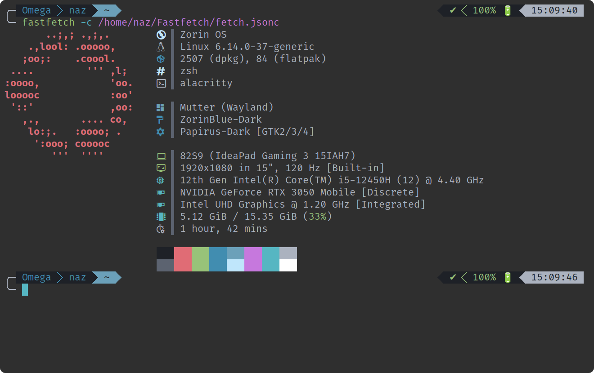

# My Terminal Setup – Zsh + Powerlevel10k + Alacritty

Modern, fast and beautiful terminal configuration for Linux  
(zsh + Powerlevel10k theme + fast-syntax-highlighting + Alacritty terminal)

  

## ✨ Features
- based on old good project PLAFON
- Powerlevel10k — one of the fastest & most beautiful zsh themes
- Very fast syntax highlighting (`fast-syntax-highlighting`)
- Modern icons in `ls` (`eza` & `lsd`)
- Lots of useful aliases (system, flatpak, DaVinci Resolve video conversion, etc.)
- Clean & minimal Alacritty theme with nice colors
- FiraCode Nerd Font with ligatures
- Semi-transparent window + no titlebar

## 📂 What's inside

```text
📂 zsh.
└──.zshrc
📂 alacritty            # Main zsh configuration + Powerlevel10k + plugins
└── alacritty.toml      # Alacritty terminal emulator settings
```

## 🚀 Installation

### 1. Dependencies (Debian/Ubuntu-based example)

```bash
# Update system & install base packages
sudo apt update
sudo apt install -y zsh git neovim inxi dmidecode curl wget gpg

# Fastfetch (newer & prettier than neofetch)
# On recent Ubuntu/Debian/ZorinOS (24.04+/18 version and over, Trixie/Sid) it's often in repos:
sudo apt install -y fastfetch
# Older versions → download latest .deb from releases:
# https://github.com/fastfetch-cli/fastfetch/releases
# Example for amd64:
# wget https://github.com/fastfetch-cli/fastfetch/releases/download/2.x.x/fastfetch-linux-amd64.deb
# sudo dpkg -i fastfetch-linux-amd64.deb
# sudo apt install -f   # fix any missing dependencies

# FiraCode Nerd Font (manual install – highly recommended for icons/ligatures)
mkdir -p ~/.local/share/fonts
cd ~/.local/share/fonts
wget https://github.com/ryanoasis/nerd-fonts/releases/download/v3.2.1/FiraCode.zip
unzip FiraCode.zip "*.ttf" -d fira-code-nerd
fc-cache -fv
rm FiraCode.zip
# After install → select "FiraCode Nerd Font" in terminal settings

# Modern ls tools (eza recommended)
# Add official eza repo (latest version)
sudo mkdir -p /etc/apt/keyrings
wget -qO- https://raw.githubusercontent.com/eza-community/eza/main/deb.asc | sudo gpg --dearmor -o /etc/apt/keyrings/gierens.gpg
echo "deb [signed-by=/etc/apt/keyrings/gierens.gpg] http://deb.gierens.de stable main" | sudo tee /etc/apt/sources.list.d/gierens.list
sudo chmod 644 /etc/apt/keyrings/gierens.gpg /etc/apt/sources.list.d/gierens.list
sudo apt update
sudo apt install -y eza

# Alternative: lsd via snap (easy) p.s. I hate snaps do what you want
sudo apt install -y snapd
sudo snap install lsd

# zplug (zsh plugin manager)
sudo apt install -y zplug
```

### Papirus Icon Theme (highly recommended – beautiful, colorful, modern icons)

Papirus is a perfect match for your dark minimal setup — pixel-perfect, with many app icons and folder variants.

**For Ubuntu 20.04+ / Linux Mint / Pop!_OS etc.** (easiest & latest versions):

```bash
sudo add-apt-repository ppa:papirus/papirus
sudo apt update
sudo apt install papirus-icon-theme
```

**For pure Debian** (or if PPA doesn't work smoothly):

```bash
sudo sh -c "echo 'deb http://ppa.launchpad.net/papirus/papirus/ubuntu jammy main' > /etc/apt/sources.list.d/papirus-ppa.list"
wget -qO- https://keyserver.ubuntu.com/pks/lookup?op=get&search=0x9461999446FAF0DF770BFC9AE58A9D36647CAE7F | sudo gpg --dearmor -o /etc/apt/trusted.gpg.d/papirus.gpg
sudo apt update
sudo apt install papirus-icon-theme
```

After installation → open **GNOME Tweaks** (`sudo apt install gnome-tweaks`), go to **Appearance → Icons**, and select **Papirus** / **Papirus-Dark**.

### 2. Install the terminal configuration

```bash
# Backup existing configs (recommended!)
cp ~/.zshrc ~/.zshrc.bak 2>/dev/null || true
mkdir -p ~/.config/alacritty
cp ~/.config/alacritty/alacritty.toml ~/.config/alacritty/alacritty.toml.bak 2>/dev/null || true

# Copy new files
cp .zshrc ~/.zshrc
cp alacritty.toml ~/.config/alacritty/alacritty.toml

# Set zsh as default shell
chsh -s /usr/bin/zsh

# Restart terminal or run:
exec zsh
# → zplug will auto-install plugins on first launch
```

## 🎨 Color Scheme

Dark minimal theme inspired by One Dark / Dracula vibes

- Background:   `#242424`
- Foreground:   `#ABB2BF`
- Accent/Cyan:  `#56B6C2`
- Purple:       `#C678DD`
- Green:        `#98C379`
- Red:          `#E06C75`

## Useful aliases you will get

```bash
# Quick view
l           # beautiful detailed ls with dates (lsd)
n           # fastfetch with custom config
c           # clear

# System
son         # suspend
r / reboot  # reboot
ram         # show RAM speed
cpu         # show CPU model

# Flatpak (if installed)
fli         # flatpak install
flr         # flatpak remove
fl          # flatpak list

# DaVinci Resolve video preparation
dav         # convert all videos in current folder to davinci-compatible mov
```

## 💡 Recommendations

- Pair **Papirus-Dark** icons with your dark theme — looks stunning!
- Restart your terminal after font/icon changes
- Update Papirus regularly: `sudo apt update && sudo apt upgrade papirus-icon-theme`
- Enjoy your clean & glowing terminal! 🚀

Happy hacking on Debian-based Linux and you can do it on any distro! 😄
```
🇺🇦-version soon
