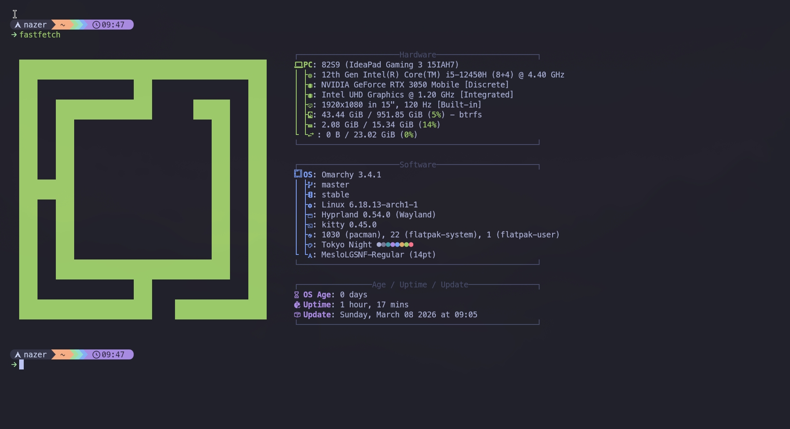

# Minimal Zsh Configuration ⚡

A fast and minimal **Zsh configuration** focused on productivity for **Arch Linux**, with useful aliases, lightweight plugins, and a modern prompt.

<kbd>[](README.uk.md)</kbd>



## ✨ Features

* ⚡ Fast startup
* 🧠 Command autosuggestions
* 🎨 Syntax highlighting
* 🚀 Modern prompt using Starship
* 📦 Flatpak management aliases
* 🐧 Pacman / AUR helper aliases
* 📂 Useful Git shortcuts
* 🖥 KDE Plasma optimizations

---

# 📦 Plugins

This config automatically installs and loads:

* **fast-syntax-highlighting** – Fast command syntax highlighting
* **zsh-autosuggestions** – Fish-like command autosuggestions

Plugins are stored inside:

```
~/.zsh/
```

---

# 🚀 Prompt

This setup uses **Starship** for a modern and fast prompt.

Initialize with:

```bash
eval "$(starship init zsh)"
```

Optional prompt alternative:

```
oh-my-posh
```

---

# 🧰 Included Aliases

## Git

```
gs      git status
gcm     git commit -m
gco     git checkout
gcob    git checkout -b
gsw     git switch
gp      git pull && git push
gpl     git pull
gf      git fetch --all --prune
gundo   git reset --soft HEAD~1
gst     git stash
pop     git stash pop
gstapp  git stash apply
```

---

## Editor

```
vim     → nvim
svim    → sudo nvim
ez      → edit ~/.zshrc
sz      → reload ~/.zshrc
```

---

## File Listing

Uses modern replacements for `ls`.

```
ls      eza --icons
l       lsd -lah with date
```

---

## Flatpak

```
fps     flatpak search
fpi     flatpak install
fpr     flatpak remove
fpl     flatpak list
fpu     flatpak update
fpclean flatpak uninstall --unused
fr      flatpak run
```

---

## Pacman

```
pu      sudo pacman -Syu
pi      sudo pacman -S
pr      sudo pacman -Rns
ps      pacman -Ss
psi     pacman -Qs
porphans remove orphan packages
```

---

## AUR (yay)

```
yi      yay -S
yu      yay -Syu
ys      yay -Ss
```

---

# 📜 History Configuration

```
HISTFILE = ~/.zsh_history
HISTSIZE = 100000
SAVEHIST = 100000
```

Shared history between all terminal sessions:

```
setopt SHARE_HISTORY
```

---

# 🖥 KDE Optimization

For smoother compositing on KDE Plasma:

```
export KWIN_TRIPLE_BUFFER=1
```

---

# 📥 Installation

Clone the repository:

```
git clone https://github.com/Nazeonix/Linux-dots.git 
```

Copy configuration:

```
cp .zshrc ~/.zshrc
```

Restart shell:

```
source ~/.zshrc
```

---

# 📁 Directory Structure

```
~/.zsh
 ├── fast-syntax-highlighting
 └── zsh-autosuggestions
```

---

# 🎯 Goals

This configuration aims to provide:

* a **fast shell**
* a **clean developer environment**
* **minimal dependencies**
* **powerful aliases**

---

### 1. Dependencies (Debian/Ubuntu-based example)

```bash
# Update system & install base packages
sudo apt update
sudo apt install -y zsh git neovim inxi dmidecode curl wget gpg

# Fastfetch (newer & prettier than neofetch)
# On recent Ubuntu/Debian/ZorinOS (24.04+/18 version and over, Trixie/Sid) it's often in repos:
sudo apt install -y fastfetch
# Older versions → download latest .deb from releases:
# https://github.com/fastfetch-cli/fastfetch/releases
# Example for amd64:
# wget https://github.com/fastfetch-cli/fastfetch/releases/download/2.x.x/fastfetch-linux-amd64.deb
# sudo dpkg -i fastfetch-linux-amd64.deb
# sudo apt install -f   # fix any missing dependencies

# FiraCode Nerd Font (manual install – highly recommended for icons/ligatures)
mkdir -p ~/.local/share/fonts
cd ~/.local/share/fonts
wget https://github.com/ryanoasis/nerd-fonts/releases/download/v3.2.1/FiraCode.zip
unzip FiraCode.zip "*.ttf" -d fira-code-nerd
fc-cache -fv
rm FiraCode.zip
# After install → select "FiraCode Nerd Font" in terminal settings

# Modern ls tools (eza recommended)
# Add official eza repo (latest version)
sudo mkdir -p /etc/apt/keyrings
wget -qO- https://raw.githubusercontent.com/eza-community/eza/main/deb.asc | sudo gpg --dearmor -o /etc/apt/keyrings/gierens.gpg
echo "deb [signed-by=/etc/apt/keyrings/gierens.gpg] http://deb.gierens.de stable main" | sudo tee /etc/apt/sources.list.d/gierens.list
sudo chmod 644 /etc/apt/keyrings/gierens.gpg /etc/apt/sources.list.d/gierens.list
sudo apt update
sudo apt install -y eza # p.s. eza can be in ubuntu/zorin/archnrepos

```

### Papirus Icon Theme (highly recommended – beautiful, colorful, modern icons)

Papirus is a perfect match for your dark minimal setup — pixel-perfect, with many app icons and folder variants.

**For Ubuntu 20.04+ / Linux Mint / Pop!_OS etc.** (easiest & latest versions):

```bash
sudo add-apt-repository ppa:papirus/papirus
sudo apt update
sudo apt install papirus-icon-theme
```

**For pure Debian** (or if PPA doesn't work smoothly):

```bash
sudo sh -c "echo 'deb http://ppa.launchpad.net/papirus/papirus/ubuntu jammy main' > /etc/apt/sources.list.d/papirus-ppa.list"
wget -qO- https://keyserver.ubuntu.com/pks/lookup?op=get&search=0x9461999446FAF0DF770BFC9AE58A9D36647CAE7F | sudo gpg --dearmor -o /etc/apt/trusted.gpg.d/papirus.gpg
sudo apt update
sudo apt install papirus-icon-theme
```
**For Arch cons ❤️**
```bash
sudo pacman -S eza starship ttf-meslo-nerd papirus-icon-theme --needed
```
After installation → open **GNOME Tweaks** (`sudo apt install gnome-tweaks`), go to **Appearance → Icons**, and select **Papirus** / **Papirus-Dark**.

## 🎨 Color Scheme

Dark minimal theme inspired by One Dark / Dracula vibes

- Background:   `#242424`
- Foreground:   `#ABB2BF`
- Accent:       `#56B6C2`
- Purple:       `#C678DD`
- Green:        `#98C379`
- Red:          `#E06C75`

## 💡 Recommendations

- Pair **Papirus-Dark** icons with your dark theme — looks stunning!
- Restart your terminal after font/icon changes
- Update Papirus regularly: `sudo apt update && sudo apt upgrade papirus-icon-theme`
- Enjoy your clean & glowing terminal! 🚀

Happy hacking on Debian and Arch based Linux and you can do it on any distro! 😄
```
🇺🇦-version soon
